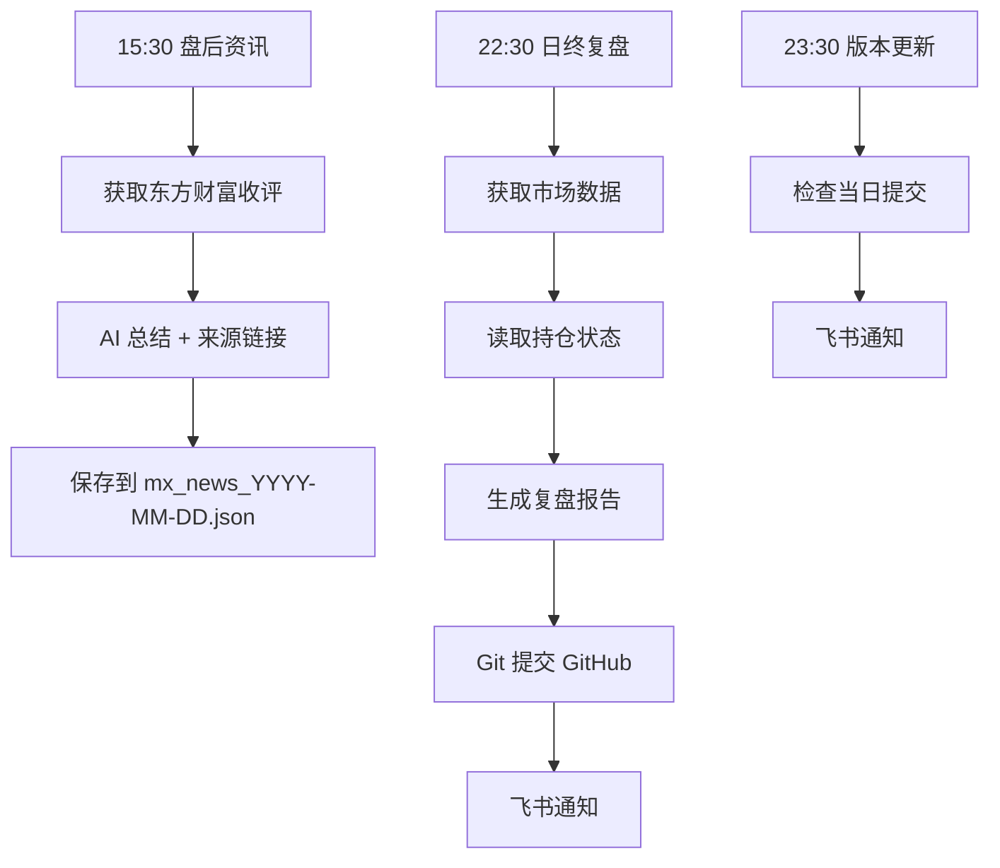

# 基金日终复盘系统

**每日交易结束后自动生成复盘报告，集成东方财富妙想 API，推送到飞书群并归档到 GitHub**

---

## 🚀 核心功能

### 1. 自动日终复盘
- ⏰ **执行时间**：每个交易日 22:30
- 📊 **内容**：持仓盈亏 + 市场分析 + 亏损原因 + 后市展望
- 🔄 **归档**：自动提交到 GitHub

### 2. 东方财富资讯集成
- 📰 **盘后收评**：15:30 自动获取当日收评
- 🤖 **AI 总结**：提取重点，不是复制粘贴
- 🔗 **来源链接**：可点击查看详情
- 🔄 **多源 fallback**：收评→复盘→要闻，智能切换

### 3. 飞书通知
- 📢 **简洁版**：持仓 + 资讯摘要 + 挑战进度
- 🔗 **GitHub 链接**：一键查看完整报告
- ⏰ **完成时间**：约 22:35 推送

### 4. 系统监控
- 📊 **版本更新**：23:30 检查当日提交
- 🔍 **Cron 健康**：每小时检查任务状态
- ⚠️  **异常告警**：失败自动重试 + 飞书通知

---

## 📊 复盘报告模板

```markdown
# 日终复盘 YYYY-MM-DD

## 📊 今日盈亏
| 项目 | 数值 |
|------|------|
| 今日盈亏 | +/-XX.XX 元 |
| 组合市值 | XXX.XX 元 |
| 投入本金 | XXX.XX 元 |
| 累计盈亏 | +/-XX.XX 元 |
| 累计收益率 | +/-X.XX% |

## 📈 持仓明细
| 基金 | 代码 | 今日盈亏 | 累计盈亏 |
|------|------|----------|----------|
| ... | ... | ... | ... |

## 📰 今日要闻（东方财富）
**1. 标题关键词**
内容摘要
*来源：[来源名](链接)* | 时间

**2. 标题关键词**
内容摘要
*来源：[来源名](链接)* | 时间

## 📝 今日总结
### 市场表现
- 上证指数：+/-X.XX%
- 创业板指：+/-X.XX%
- 科创 50: +/-X.XX%

### 亏损原因分析
1. 市场因素
2. 板块因素
3. 持仓因素

### 后市展望
- 短期/中期/操作建议

## 📅 挑战进度
- 挑战开始：YYYY-MM-DD
- 当前天数：第 X 天
- 目标金额：XXXX 元
- 距离目标：+/-XXX.XX 元
```

---

## 📢 飞书通知模板

```
✅ YYYY-MM-DD 日终复盘

💰 组合价值：¥XXX.XX
📉 累计盈亏：+/-XX.XX 元 (+/-X.XX%)

📋 持仓详情:
  基金 A: +/-X.XX 元 | 累计+/-X.XX 元
  基金 B: +/-X.XX 元 | 累计+/-X.XX 元

📰 重要资讯:
1. 资讯标题关键词... (来源)
2. 资讯标题关键词... (来源)
3. 资讯标题关键词... (来源)

📅 挑战进度：第 X 天 | 目标 XXXX 元 | 距离+/-XXX.XX 元

📝 完整报告：[GitHub](链接)

⏰ HH:MM
```

---

## 🛠️ 核心脚本

| 脚本 | 作用 | 执行时间 |
|------|------|----------|
| `auto_review_automation.py` | 日终复盘全流程 | 22:30 |
| `fund-daily-review.sh` | 包装脚本（含飞书通知） | 22:30 |
| `mx-market-news.sh` | 东方财富资讯获取 | 15:30 |
| `system-version-update.sh` | 版本更新检查 | 23:30 |
| `cron_health_monitor.py` | Cron 健康监控 | 每小时 |

---

## 📁 文件结构

```
08-fund-daily-review/
├── README.md                   # 本文档
├── reviews/                    # 复盘报告存档
│   ├── 2026-03-30.md          # 最新报告
│   ├── 2026-03-27.md
│   └── ...
├── state.json                  # 当前持仓状态
└── ledger.jsonl                # 交易记录
```

---

## 🎯 执行流程



---

## 📊 东方财富 API 功能

### 资讯查询（多源 fallback）
```bash
1. 查询"收评" → 失败？
2. 查询"复盘" → 失败？
3. 查询"收盘点评" → 失败？
4. 查询"A 股市场" → 失败？
5. 查询"重要新闻" → ✅ 成功
```

### 资讯处理
- ✅ **AI 总结**：提取核心要点，不是复制粘贴
- ✅ **来源链接**：每条资讯附带可点击链接
- ✅ **时间显示**：显示资讯发布时间
- ✅ **盘后优先**：优先获取 15:00 后的收评

---

## 📝 使用示例

### 手动执行日终复盘
```bash
cd /home/admin/.openclaw/workspace/skills/fund-challenge
python3.11 fund_challenge/scripts/auto_review_automation.py \
  --base /home/admin/.openclaw/workspace/Semi-automatic-artificial-intelligence-system \
  --generate-report
```

### 获取盘后资讯
```bash
bash /home/admin/.openclaw/workspace/05-scripts/mx-market-news.sh
```

### 检查系统版本更新
```bash
bash /home/admin/.openclaw/workspace/05-scripts/system-version-update.sh
```

---

## 🔗 相关链接

- [GitHub 仓库](https://github.com/heyaaron-Wu/Semi-automatic-artificial-intelligence-system)
- [东方财富妙想](https://marketing.dfcfs.com/views/finskillshub/indexIoMv0EzE)
- [飞书开放平台](https://open.feishu.cn/document/)

---

*最后更新：2026-03-31*
