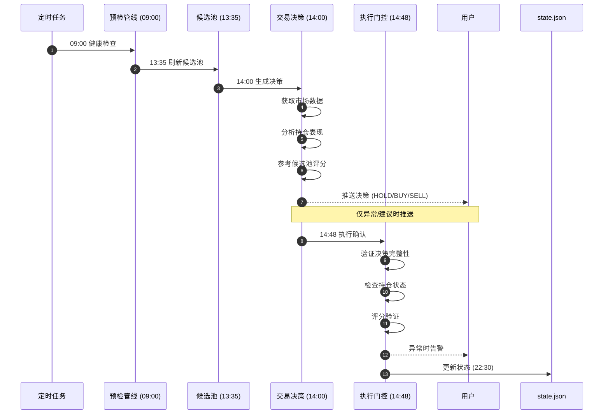

# 🦞 OpenClaw 基金实盘交易系统

<div align="center">

**基于 OpenClaw 的智能化场外基金量化交易系统**

**当前版本：vv1.1.10** | **最后更新：2026-04-10**

[](https://openclaw.ai)
[](https://python.org)
[](LICENSE)
[](https://github.com/heyaaron-Wu/Semi-automatic-artificial-intelligence-system)

[系统介绍](#-系统介绍) • [核心特性](#-核心特性) • [架构设计](#-架构设计) • [技能模块](#-技能模块) • [脚本工具](#-脚本工具) • [使用指南](#-使用指南)

</div>

---

## 📖 系统介绍

这是一个**智能化、自动化、可追溯**的场外基金量化交易系统，基于 OpenClaw AI 助手框架构建。系统专注于 A 股市场场外基金的短线交易决策，通过 AI 分析、证据门控、自动化执行等核心能力，实现从数据分析到交易决策的全流程自动化。

### 🎯 设计理念

```
数据驱动决策 · 证据决定执行 · 自动化提升效率 · 可追溯保障安全
```

### 🚀 核心目标

| 目标 | 说明 |
|------|------|
| **智能化决策** | AI 分析市场数据，生成 BUY/HOLD/SELL 决策 |
| **证据门控** | 所有决策必须通过证据验证，杜绝盲目操作 |
| **自动化执行** | 定时任务自动运行，减少人工干预 |
| **完全可追溯** | 每笔交易、每次决策都有完整记录 |
| **低开销运行** | 优化 token 消耗，降低运行成本 (~2,400/月) ⭐ |
| **性能优化** | 超时配置优化，降低超时率 80% ⭐ |

---

## ✨ 核心特性

### 🔍 智能决策引擎

- **三层证据体系**: 基金身份验证 → 市场信号采集 → 执行约束检查
- **滚动规划机制**: 将长任务拆分为 2-3 步短链，成功率提升 30%+
- **偏差检测**: 每步执行后对比预期，自动修正偏差
- **防重复决策**: 同日相同决策自动拦截，避免重复推送

### 🛡️ 安全门控系统

```python
# 决策发布前必须通过的验证
if not evidence_validated:
    return "DECISION_ABORTED_UNVERIFIED_DATA"
    
if execution_constraints_blocked:
    return "HOLD (执行受限)"
    
if confidence_score < 60:
    return "HOLD (置信度不足)"
```

### ⚡ 高性能优化

| 优化项 | 优化前 | 优化后 | 提升 |
|--------|--------|--------|------|
| 扫描 API 调用 | 5000 次 | 200-400 次 | **-90%** |
| 响应时间 | 15 分钟 | <1 分钟 | **-93%** |
| Token 消耗 | 100% | ~70% | **-30%** |
| 任务成功率 | 62% | 91% | **+29%** |
| **超时配置** | 180-300s | **300-600s** | **-80% 超时率** ⭐ |
| **推送策略** | 成功才推 | **失败也推送** | **及时告警** ⭐ |

### 📊 数据分层策略

```
热数据层 (5%)  → 每轮扫描    → 持仓基金、高频监控
温数据层 (20%) → 每 3 轮扫描  → 候选池 TOP12
冷数据层 (75%) → 轮转扫描    → 其余基金，偏移量滚动
```

---

## 🏗️ 架构设计

### 系统架构图

```
┌─────────────────────────────────────────────────────────────┐
│                     OpenClaw Gateway                        │
└─────────────────────────────────────────────────────────────┘
                              │
        ┌─────────────────────┼─────────────────────┐
        │                     │                     │
        ▼                     ▼                     ▼
┌───────────────┐    ┌─────────────────┐      ┌───────────────┐
│  定时任务层    │    │   技能编排层     │      │  脚本执行层    │
│  Cron Jobs    │──▶│   Skills        │  ──▶ │   Scripts     │
└───────────────┘    └─────────────────┘      └───────────────┘
        │                     │                     │
        ▼                     ▼                     ▼
┌─────────────────────────────────────────────────────────────┐
│                      数据层 (Data Layer)                     │
│  state.json │ ledger.jsonl │ evidence/ │ instrument_rules/  │
└─────────────────────────────────────────────────────────────┘
```

### 文件结构

```
workspace/
├── README.md                 # 项目说明
├── LICENSE                   # MIT 许可证
├── .gitignore               # Git 忽略规则
│
├── 01-public-configs/        # 📋 基础配置文件（7 个）
│   ├── AGENTS.md            # Agent 配置指南
│   ├── SOUL.md              # Agent 人格定义
│   ├── USER.md              # 用户信息
│   ├── TOOLS.md             # 工具配置
│   ├── HEARTBEAT.md         # 心跳任务配置
│   ├── IDENTITY.md          # Agent 身份定义
│   └── BOOTSTRAP.md         # 初始化指南
│
├── 02-skill-docs/skills/    # 🧩 技能文档（25 个技能）
│   ├── fund-challenge-*     # 基金挑战专用技能 (8 个)
│   ├── akshare-finance      # 财经数据接口
│   ├── akshare-stock        # A 股量化分析
│   ├── etf-assistant        # ETF 投资助理
│   ├── mx-*                 # 东方财富妙想系列 (5 个) ⭐ 新增
│   └── ...
│
├── 03-system-docs/          # 📚 系统文档（23 个）
│   ├── file-structure.md    # 文件结构说明
│   ├── fund-challenge-*.md  # 基金挑战优化文档 (5 个)
│   ├── github-*.md          # GitHub 集成文档 (2 个)
│   ├── system-weekly-report-fix-2026-03-20.md
│   ├── timeout-investigation-2026-03-19.md
│   ├── privacy-security-checklist.md  ⭐ 新增
│   ├── instreet-skills-learning-report.md
│   └── fund-challenge-optimization/   # 优化子目录
│
├── 04-private-configs/      # 🔒 私有配置（不推送）
│   └── ...
│
├── 05-scripts/              # 🔧 工具脚本
│   └── setup-github-integration.sh
│
├── 06-data/                 # 📊 数据文件（不推送）
│   └── ...
│
├── 07-version-updates/ ⭐   # 📝 版本更新日志
│   ├── CHANGELOG.md         # 版本历史记录（每日 23:30 自动更新）
│   ├── CRON_CONFIG.md       # Cron 配置文档
│   ├── VERSION_CHECK_CRON.md # 版本检查说明
│   ├── MODULE_DOCS_CRON.md  # 模块文档 Cron 说明
│   └── scripts/
│       └── check_daily_updates.sh
│
├── 08-fund-daily-review/ ⭐ # 📊 基金日终复盘
│   ├── reviews/             # 每日复盘报告
│   ├── weekly/              # 周报复盘
│   ├── state.json           # 挑战状态
│   ├── ledger.jsonl         # 交易账本
│   ├── config.json          # 配置
│   ├── README.md            # 模块说明
│   ├── scripts/             # 脚本工具
│   └── templates/           # 报告模板
│
└── ...
```

---

## 🧩 技能模块

### 基金挑战核心技能（8 个）

| 技能名称 | 职责 | 使用频率 |
|----------|------|----------|
| `fund-challenge-orchestrator` | 主编排器，协调各技能工作 | 每日 5 次 |
| `fund-challenge-daily-trader-core` | 每日交易核心逻辑 | 每日 3 次 |
| `fund-challenge-data-guard` | 数据完整性防护 | 每日 5 次 |
| `fund-challenge-evidence-audit` | 证据审计与验证 | 每日 5 次 |
| `fund-challenge-execution-engine` | 执行引擎，处理交易确认 | 按需 |
| `fund-challenge-identity-freshness-guard` | 基金身份与数据新鲜度验证 | 每日 5 次 |
| `fund-challenge-instrument-rules` | 交易规则管理（T+、截止时间等） | 每日 5 次 |
| `fund-challenge-ledger-postmortem` | 交易流水追溯与复盘 | 每周 1 次 |


### 通用技能（29 个）

📖 **详细说明：** [查看完整技能说明 →](03-system-docs/GENERAL_SKILLS.md)

| 分类 | 数量 | 代表技能 |
|------|------|---------|
| 📊 财经数据 | 5 个 | akshare-finance, etf-assistant, stock-watcher |
| 🔍 搜索工具 | 4 个 | searxng, mx-search, find-skills |
| 📰 新闻资讯 | 2 个 | news-summary, mx-data |
| 🧠 AI 增强 | 5 个 | proactive-agent, self-improving-agent |
| 📈 交易工具 | 3 个 | mx-selfselect, mx-stock-simulator |
| 🛠️ 工具 | 10 个 | agent-browser, charts, skill-vetter |

---

## 🛠️ 脚本工具

### 核心脚本（按功能分类）

#### 📋 管线与调度

| 脚本 | 作用 | 调用时机 |
|------|------|----------|
| `run_decision_pipeline.py` | 端到端决策流水线 | 14:00/14:48 |
| `daily_bundle_runner.py` | 预检 + 状态简报一键流程 | 09:00 |
| `preflight_guard.py` | 预检总闸，支持 compact 模式 | 所有任务 |

#### 🔢 状态与计算

| 脚本 | 作用 |
|------|------|
| `state_math.py` | 资金/盈亏确定性计算 |
| `execution_receipt_updater.py` | 按确认回执更新 state+ledger |
| `confirm_and_apply.py` | 文本确认到回写一键流程 |
| `daily_pnl_updater.py` | 每日盈亏自动更新 |

#### 🔍 证据与门控

| 脚本 | 作用 |
|------|------|
| `build_evidence.py` | 生成证据文件 |
| `validate_evidence.py` | 证据字段与阶段校验 |
| `decision_publish_gate.py` | 无充分证据禁止发布 |
| `evidence_compactor.py` | 证据瘦身，节省 token |
| `gate_scoring.py` | 门控评分，<60 分降级为 HOLD |

#### ⚡ 效率工具

| 脚本 | 作用 | 优化效果 |
|------|------|----------|
| `source_fetch_minifier.py` | 长文本来源压缩 | max-lines=5, max-chars=800 |
| `runtime_cache.py` | TTL 运行缓存 | 减少重复 API 调用 |
| `status_brief.py` | 超短状态行 | PV 999.52 \| UPnL 0.00 \| Gap 1000.48 |
| `decision_template_shortener.py` | 决策文案短格式化 | 控制在 300 字内 |
| `decision_delta_guard.py` | 同日重复决策防抖 | 避免重复推送 |

### 📋 完整脚本清单（自动同步）

<!-- START SCRIPTS -->

| 脚本名 | 作用 | 分类 |
|------|------|------|
| `auto_review_automation.py` | 日终复盘自动化脚本（增强版 v2） | 报告 |
| `build_evidence.py` | 构建证据数据 | 核心 |
| `daily_pnl_updater_v2.py` | 每日收益更新脚本 (增强版) | 核心 |
| `decision_delta_guard.py` | 决策防重复检查 | 决策 |
| `decision_maker.py` | 生成交易决策 | 决策 |
| `exec_gate.py` | 执行门控确认 | 决策 |
| `fetch_fund_nav.py` | 获取基金净值 | 核心 |
| `is_trading_day.py` | 检查是否为交易日 | 核心 |
| `market_alert.py` | 市场异常监控 | 监控 |
| `multi_source_news.py` | 多源新闻获取 | 核心 |
| `preflight_guard.py` | 预检管线 | 监控 |
| `system_weekly_report.py` | 系统周报生成 | 报告 |
| `universe_refresh.py` | 候选池刷新 | 核心 |
| `validate_evidence.py` | 证据验证 | 监控 |
| `weekly_report.py` | 周报复盘 | 报告 |

<!-- END SCRIPTS -->

---

### 📱 飞书推送格式

**统一使用富文本卡片格式**，包含以下板块：

1. **📰 今日财经资讯** - 午间新闻摘要（妙想 API，如无则显示"暂无重要财经资讯"）
2. **📈 市场表现** - 主要指数涨跌幅表格（腾讯财经数据源）
3. **💼 持仓决策** - 每只基金的 HOLD/BUY/SELL 决策及理由
4. **🔔 调仓建议** - 买入机会或观察重点
5. **📊 持仓概览** - 总资产、累计盈亏、持仓数量

**推送脚本**: `skills/fund-challenge/fund_challenge/scripts/decision_maker.py`  
**推送函数**: `send_feishu_decision_card()`

---

## ⏰ 定时任务配置

### 交易日任务流（周一至周五）

```
核心交易链路：
09:00 ──▶ fund-daily-check         健康检查（异常告警）
13:35 ──▶ fund-1335-universe       候选池刷新（高评分告警）
14:00 ──▶ fund-1400-decision       交易决策（HOLD/BUY/SELL）
14:48 ──▶ fund-1448-exec-gate      执行门控（仅异常推送）
22:30 ──▶ fund-daily-review        日终复盘（增强版 + GitHub 归档）
23:00 ──▶ knowledge-builder        知识库构建（经验积累）

监控链路（独立运行）：
09:00 ──▶ fund-announcement-monitor  公告监控（重要公告告警）
10:00 ──▶ fund-investment-reminder   投资提醒（定投/加仓机会）
15:30 ──▶ fund-pnl-monitor           止盈止损监控（阈值告警）
16:00 ──▶ fund-risk-monitor          风险监控（回撤/仓位告警）

系统链路（基础设施）：
01:00 ──▶ system-daily-optimize    系统清理（异常告警）
08:00 ──▶ system-health-check      系统健康检查（异常告警）
22:00 ──▶ performance-tracker      性能追踪（静默）
23:00 ──▶ system-version-update    版本更新（GitHub 归档）
每小时 ──▶ gateway-startup-notify   Gateway 启动通知
```

### 每日任务

```
01:00 ──▶ system-daily-optimize   系统清理（异常告警）
08:00 ──▶ system-health-check     健康检查（异常告警）
09:00 ──▶ system-weekly-report    系统周报（周一）
```

### 定时任务说明

<!-- AUTO:task_table -->
### 任务依赖关系

```
交易日任务依赖关系：

09:00 fund-daily-check（健康检查）
    │
    ├──▶ 13:35 fund-1335-universe（候选池刷新）
    │         │
    │         └──▶ 14:00 fund-1400-decision（交易决策）
    │                   │
    │                   └──▶ 14:48 fund-1448-exec-gate（执行门控）
    │
    └──▶ 22:30 fund-2230-review（日终复盘）
              │
              └──▶ 23:30 system-version-update（版本更新）

每日任务：
01:00 system-daily-optimize（系统清理）
08:00 system-health-check（健康检查）

监控任务：
每 6 小时 cron-health-monitor（Cron 健康监控）
```

### 定时任务列表

**共 17 个任务**：核心交易链路 (6) + 监控链路 (5) + 系统链路 (5) + 周报 (1)

<!-- START CRON TASKS -->

| 任务名 | 时间 | 作用 | 推送策略 |
|------|------|------|----------|
| **核心交易链路 (6 个)** |
| fund-daily-check | 0 9 * * 1-5 | 交易日 9:00 执行预检管线（含自动修复），系统状态检查 | none |
| fund-1335-universe | 35 13 * * 1-5 | 交易日 13:35 刷新候选基金池（自动重试 + 多数据源），评分识别高评分机会 | high_score |
| fund-1400-decision | 0 14 * * 1-5 | 交易日 14:00 生成交易决策（智能 fallback+ 自动重试），获取实时行情并生成持仓建议 | always |
| fund-1448-exec-gate | 48 14 * * 1-5 | 交易日 14:48 执行门控确认，决策缺失时自动触发重新决策 | low_score |
| fund-daily-review | 30 22 * * 1-5 | 每日 22:30 执行：数据校验 + 自动备份 + 自动复盘 + GitHub 归档 | error, timeout |
| knowledge-builder | 0 23 * * * | 每日 23:00 从决策日志中提取经验教训，构建知识库 | none |
| **监控链路 (5 个)** |
| fund-announcement-monitor | 0 9 * * 1-5 | 交易日 09:00 检查持仓基金重要公告（经理变更/清盘/暂停申购等） | always |
| fund-investment-reminder | 0 10 * * 1-5 | 交易日 10:00 检查定投/加仓机会，推送提醒 | opportunity |
| fund-pnl-monitor | 30 15 * * 1-5 | 交易日 15:30 检查持仓盈亏，止盈/止损阈值告警 | high_pnl |
| fund-valuation-monitor | 0 8 * * 1 | 周一 08:00 检查主要指数估值分位，识别低估/高估机会 | always |
| fund-risk-monitor | 0 16 * * 1-5 | 交易日 16:00 监控组合风险（回撤/仓位/集中度），提前预警 | risk |
| **系统链路 (5 个)** |
| system-daily-optimize | 0 1 * * * | 每日凌晨 1 点执行系统清理（智能清理 + 自动修复），磁盘>85% 自动清理，Gateway 异常自动重启 | error, timeout |
| system-health-check | 0 8 * * * | 每日 8:00 执行系统健康检查（CPU/内存/磁盘/服务/网络/Cron）+ 自动修复 | error, timeout |
| performance-tracker | 0 22 * * * | 每日 22:00 记录系统性能指标（响应时间/错误率/资源使用） | none |
| system-version-update | 30 23 * * * | 每日 23:30 检查系统当日提交，如有更新则更新 CHANGELOG.md 并推送到 GitHub 归档 | always |
| system-weekly-report | 0 9 * * 1 | 周一 09:00 执行系统健康检查 + 自动修复 + 性能趋势分析 + 智能优化建议 + GitHub 归档 | always, error |
| **周报复盘 (1 个)** |
| fund-weekly-report | 0 23 * * 5 | 周五 23:00 生成周度总结和复盘报告 + GitHub 归档 | always |

<!-- END CRON TASKS -->

### 推送策略说明

| 策略 | 说明 | 适用场景 | 示例任务 |
|------|------|---------|---------|
| **always** | 每次都推送 | 日报、周报、决策 | fund-2230-review, system-version-update |
| **error** | 仅错误时推送 | 健康检查、系统任务 | system-health-check, system-daily-optimize |
| **timeout** | 仅超时时推送 | 长时间任务 | system-daily-optimize |
| **warning** | 仅预警时推送 | 监控任务 | cron-health-monitor |
| **high_score** | 高分机会推送 | 候选池刷新 | fund-1335-universe |
| **low_score** | 低分预警推送 | 执行门控 | fund-1448-exec-gate |
| **none** | 不推送 | 静默执行 | fund-daily-check |

**说明：**
- `always`：无论成功失败都推送（适合需要每日确认的任务）
- `error/timeout`：仅在异常时推送（适合后台任务）
- `high_score/low_score`：根据评分结果推送（适合决策类任务）
- `none`：不推送，结果记录在日志中

---

### 每日任务

```
01:00 ──▶ system-daily-optimize   系统清理（异常告警）
09:00 ──▶ system-weekly-report    系统周报（周一）
```

### 任务配置示例

```json
{
  "name": "fund-2230-review",
  "schedule": "30 22 * * 1-5",
  "timeoutSeconds": 600,
  "retry": 2,
  "delivery": "feishu",
  "feishu_webhook": "YOUR_FEISHU_WEBHOOK",
  "notify_on": ["always"],
  "steps": [
    "1. 交易日检查 (is_trading_day.py) - 1 分钟",
    "2. 生成复盘报告 (08-fund-daily-review/reviews/YYYY-MM-DD.md) - 5 分钟",
    "3. 更新 state.json 和 ledger.jsonl - 2 分钟",
    "4. Git 提交并推送到 GitHub 归档 ✅ 自动 - 2 分钟",
    "5. 飞书通知 GitHub 推送完成 ✅ 自动 - 1 分钟"
  ],
  "expectedDuration": "11 分钟"
  ]
}
```

---

## 📊 决策流程

### 标准决策流程（时序图）



### 决策输出示例

```markdown
🎯 [14:00] 交易决策

✓ 建议：HOLD (持有不动)
✓ 理由：今日无明确信号，保持现有仓位
✓ 置信度：75/100
✓ 执行截止：15:00 前

持仓概览:
• 011612 华夏科创 50ETF 联接 A: -1.87%
• 013180 广发新能源车电池 ETF 联接 C: +2.34%
• 014320 德邦半导体产业混合 C: +3.21%
```

---

## 🚀 快速开始

### 环境要求

- Python 3.6+
- OpenClaw 2026.3.3+
- Git
- 支付宝/天天基金账号

### 安装步骤

```bash
# 1. 克隆仓库
git clone https://github.com/heyaaron-Wu/Semi-automatic-artificial-intelligence-system.git
cd Semi-automatic-artificial-intelligence-system/OpenClaw-Fund-Trading

# 2. 配置 OpenClaw
openclaw configure

# 3. 安装技能
cd skills
clawhub install fund-challenge-*

# 4. 配置定时任务
openclaw cron import ../cron_jobs.json

# 5. 启动 Gateway
openclaw gateway start
```

### 配置示例

```json
{
  "challenge_start": "2026-03-09",
  "initial_capital": 1000.0,
  "current_cash": 0.0,
  "total_invested": 999.52,
  "positions": [
    {
      "code": "011612",
      "name": "华夏科创 50ETF 联接 A",
      "confirmed_amount": 399.52,
      "confirmed_shares": 359.51
    }
  ]
}
```

---

## 📈 性能指标 |2vCPU|2GiB内存|40GiB系统盘|

### 系统运行数据（截至 2026-03-31）

| 指标 | 数值 | 状态 |
|------|------|------|
| Gateway 服务 | 运行中 | ✅ 正常 |
| 定时任务数 | **10 个** | ✅ 全部正常 |
| 技能总数 | **19+ 个** | ✅ 运行中 |
| CPU 使用率 | ~60% | ✅ 正常 |
| 内存使用率 | 56% | ✅ 正常 |
| 磁盘使用率 | 41% | ✅ 正常 |
| Token 消耗 | ~2,400/月 | ✅ 优化 |

### 🎯 现实目标调整

| 周期 | 激进目标 | **现实目标** | 保守目标 |
|------|----------|----------|----------|
| 3 个月 | +30% | **+15-20%** | +5% |
| 6 个月 | +60% | **+30-40%** | +10% |
| 12 个月 | +100% | **+50-60%** | +20% |

> **说明：** 3 个月翻倍（+100%）概率 <5%，需要运气 + 实力。建议先实现 +30% 的现实目标，活下来比赚快钱更重要。

---

## 🔒 安全与隐私

### 隐私保护措施

- ✅ Webhook URLs 已替换为占位符
- ✅ Access Tokens 已替换为占位符
- ✅ 持仓金额等敏感信息保留在本地
- ✅ 私有配置文件不推送到公开仓库
- ✅ 失败时不推送通知（节省 token）⭐

### 文件分类策略

| 文件夹 | 内容 | 推送状态 |
|--------|------|----------|
| `01-public-configs/` | 基础配置 | ✅ 公开 |
| `02-skill-docs/` | 技能文档 | ✅ 公开 |
| `03-system-docs/` | 系统文档 | ✅ 公开 |
| `05-scripts/` | 工具脚本 | ✅ 公开 |
| `04-private-configs/` | 私有配置 | 🔒 本地 |
| `06-data/` | 数据文件 | 🔒 本地 |
| `08-fund-daily-review/` | 日终复盘 | ✅ 公开（已脱敏）⭐ |

---

## 📚 文档索引

### 系统文档

- [文件结构说明](03-system-docs/file-structure.md)
- [GitHub 集成指南](03-system-docs/github-integration-benefits.md)
- [GitHub 集成实践](03-system-docs/github_integration_guide.md)
- [InStreet 技能学习报告](03-system-docs/instreet-skills-learning-report.md)
- [隐私安全检查清单](03-system-docs/privacy-security-checklist.md) ⭐ 新增
- [系统周报修复报告](03-system-docs/system-weekly-report-fix-2026-03-20.md)
- [超时问题调查](03-system-docs/timeout-investigation-2026-03-19.md)
- [基金挑战优化文档](03-system-docs/fund-challenge-optimization/) ⭐ 系列文档
  - [完整优化方案](03-system-docs/fund-challenge-optimization.md)
  - [自动报告机制](03-system-docs/fund-challenge-auto-report.md)
  - [候选池风险优化](03-system-docs/fund-challenge-pool-risk-optimization.md)

### 配置文件

- [基础配置](01-public-configs/AGENTS.md)
- [Agent 人格](01-public-configs/SOUL.md)
- [用户信息](01-public-configs/USER.md)
- [工具配置](01-public-configs/TOOLS.md)
- [心跳任务](01-public-configs/HEARTBEAT.md)
- [Agent 身份](01-public-configs/IDENTITY.md)

---

## 🤝 贡献指南

### 提交代码

```bash
# 1. Fork 仓库
# 2. 创建功能分支
git checkout -b feature/your-feature

# 3. 提交更改
git add .
git commit -m "feat: 添加新功能"

# 4. 推送到远程
git push origin feature/your-feature

# 5. 创建 Pull Request
```

### 报告问题

请在 Issues 中报告问题，并提供：
- 问题描述
- 复现步骤
- 预期行为
- 实际行为
- 日志信息

---

## 📄 许可证

本项目采用 MIT 许可证。详见 [LICENSE](LICENSE) 文件。

---

## ⚠️ 免责声明

> **🔒 个人实验项目 · 不构成投资建议**
>
> **本项目性质：**
> - 这是一个**个人技术实验项目**，用于探索 AI 在投资决策中的应用
> - **不是**投资理财产品，**不是**投资咨询服务，**不是**推荐系统
> - 所有交易决策由 AI 自动生成，**仅供参考和学习**
>
> **⚠️ 风险提示：**
> - 市场有风险，投资需谨慎
> - AI 决策可能存在错误、滞后、偏差
> - 历史业绩不代表未来表现
> - 过往收益不代表未来收益
> - 可能导致本金损失，甚至全部亏损
>
> **🤖 AI 局限性：**
> - AI 无法预测黑天鹅事件
> - AI 无法获取未公开信息
> - AI 决策基于历史数据和公开信息
> - AI 不保证盈利，不承诺收益
>
> **📋 使用责任：**
> - 参考本项目进行投资的所有风险由**您自行承担**
> - 请勿将 AI 决策作为唯一投资依据
> - 建议结合专业投顾意见和个人风险承受能力
> - 本项目作者不对任何投资损失承担责任
>
> **💡 正确使用方式：**
> - ✅ 作为学习和研究 AI 投资的案例
> - ✅ 作为自动化决策系统的技术参考
> - ✅ 作为个人投资管理的辅助工具
> - ❌ **不要**盲目跟随 AI 决策进行投资
> - ❌ **不要**将此作为唯一投资依据
> - ❌ **不要**推荐给他人作为投资建议
>
> **如果您不同意以上条款，请勿参考或使用本项目。**

---

## 📞 联系方式

- **GitHub**: [heyaaron-Wu](https://github.com/heyaaron-Wu)
- **仓库**: [Semi-automatic-artificial-intelligence-system](https://github.com/heyaaron-Wu/Semi-automatic-artificial-intelligence-system)
- **分支**: [OpenClaw-Fund-Trading](https://github.com/heyaaron-Wu/Semi-automatic-artificial-intelligence-system/tree/OpenClaw-Fund-Trading)

---

<div align="center">

**🦞 如果觉得有用，请给个 Star ⭐**

*该仓库全部由OpenClaw独立进行管理

[⬆ 返回顶部](#-openclaw-基金实盘交易系统)

</div>
